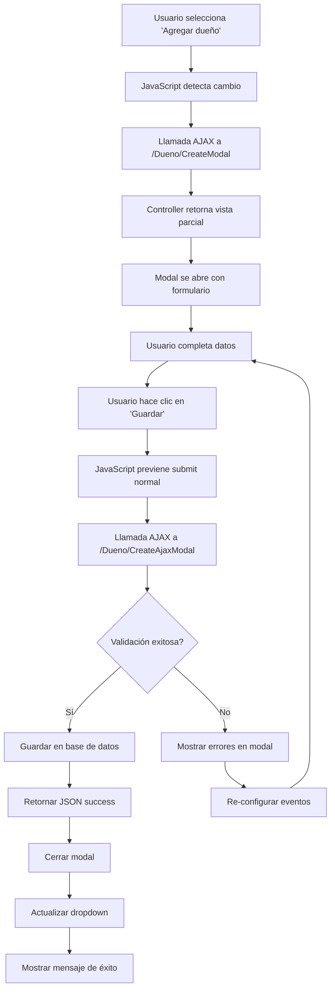

# 📋 Documentación - Modales Agregar Dueño/Mascota en Ficha de Ingreso

## 📖 Índice
1. [Resumen General](#resumen-general)
2. [Arquitectura del Sistema](#arquitectura-del-sistema)
3. [Componentes Implementados](#componentes-implementados)
4. [Flujo de Funcionamiento](#flujo-de-funcionamiento)
5. [Código Detallado](#código-detallado)
6. [Configuración y Deployment](#configuración-y-deployment)
7. [Troubleshooting](#troubleshooting)

---

## 🎯 Resumen General

### **Funcionalidad Implementada**
Sistema de modales integrados en las Fichas de Ingreso que permite agregar nuevos dueños y mascotas sin salir del formulario principal, mejorando significativamente la experiencia del usuario.

### **Características Principales**
- ✅ **Modales responsivos** con diseño consistente
- ✅ **Validación en tiempo real** (HTML5 + server-side)
- ✅ **Actualización automática** de dropdowns
- ✅ **Manejo robusto de errores** con logging detallado
- ✅ **Seguridad** con tokens antiforgery
- ✅ **UX optimizada** sin recargas de página

### **Tecnologías Utilizadas**
- **Backend**: ASP.NET Core MVC, Entity Framework Core
- **Frontend**: Bootstrap 5, jQuery, AJAX
- **Base de Datos**: SQL Server
- **Validación**: Data Annotations, jQuery Validation
- **UI/UX**: Toastr, Bootstrap Icons

---

## 🏗️ Arquitectura del Sistema

### **Patrón de Diseño**
```
┌─────────────────┐    ┌─────────────────┐    ┌─────────────────┐
│   Vista Principal│    │   Modal Dueño   │    │  Modal Mascota  │
│  (FichaIngreso)  │◄──►│   (Partial)     │    │   (Partial)     │
└─────────────────┘    └─────────────────┘    └─────────────────┘
         │                       │                       │
         ▼                       ▼                       ▼
┌─────────────────┐    ┌─────────────────┐    ┌─────────────────┐
│FichaIngresoCtrl │    │   DuenoCtrl     │    │  MascotaCtrl    │
└─────────────────┘    └─────────────────┘    └─────────────────┘
         │                       │                       │
         └───────────────────────┼───────────────────────┘
                                 ▼
                    ┌─────────────────┐
                    │ VeterinariaCtx  │
                    │  (Entity FW)    │
                    └─────────────────┘
```

### **Flujo de Datos**
1. **Usuario** selecciona "Agregar dueño/mascota" en dropdown
2. **JavaScript** abre modal y carga formulario vía AJAX
3. **Controller** retorna vista parcial con formulario
4. **Usuario** completa y envía formulario
5. **Controller** valida y guarda en base de datos
6. **JavaScript** actualiza dropdown y cierra modal
7. **Usuario** continúa con ficha de ingreso

---

## 🧩 Componentes Implementados

### **1. Controllers**

#### **DuenoController.cs**
```csharp
// Método para cargar formulario en modal
public IActionResult CreateModal()

// Método para procesar formulario AJAX
[HttpPost]
[ValidateAntiForgeryToken]
public async Task<IActionResult> CreateAjaxModal([Bind("...")] Dueno dueno)
```

#### **MascotaController.cs**
```csharp
// Método para cargar formulario en modal
public IActionResult CreateModal()

// Método para obtener razas por especie
public async Task<IActionResult> GetRazasByEspecie(int idEspecie)
```

#### **FichaIngresoController.cs**
```csharp
// Métodos para obtener datos actualizados de dropdowns
public async Task<IActionResult> GetDuenos()
public async Task<IActionResult> GetMascotas()
```

### **2. Views (Vistas)**

#### **Vistas Principales**
- `Views/FichaIngreso/Create.cshtml` - Formulario principal con modales
- `Views/FichaIngreso/Edit.cshtml` - Formulario de edición con modales

#### **Vistas Parciales (Modales)**
- `Views/Dueno/_CreatePartial.cshtml` - Formulario modal para dueños
- `Views/Mascota/_CreatePartial.cshtml` - Formulario modal para mascotas

### **3. Models (Modelos)**

#### **Dueno.cs**
```csharp
public class Dueno
{
    [Key] public int IdDueno { get; set; }
    [Required] public string Nombre { get; set; }
    [Required] public string Apellido { get; set; }
    public string? Direccion { get; set; }  // Opcional
    public string? Rut { get; set; }        // Opcional
    [Required] public string Telefono { get; set; }
    [Required] public string Email { get; set; }
    [Required] public bool Activo { get; set; } = true;
}
```

### **4. JavaScript/AJAX**

#### **Funciones Principales**
- `abrirModalDueno()` - Abre modal y carga formulario
- `configurarFormularioDueno()` - Configura eventos del formulario
- `actualizarComboDuenos()` - Actualiza dropdown después de agregar
- `abrirModalMascota()` - Abre modal de mascota
- `configurarEspeciesRazas()` - Maneja cascada especies/razas

---

## 🔄 Flujo de Funcionamiento

### **Flujo Completo - Agregar Dueño**



### **Estados del Sistema**

#### **Estado Inicial**
- Dropdown con dueños existentes + "Agregar dueño"
- Modal oculto
- Eventos JavaScript configurados

#### **Estado Modal Abierto**
- Modal visible con formulario
- Validación HTML5 activa
- Botón "Guardar" habilitado

#### **Estado Guardando**
- Botón cambia a "Guardando..."
- Botón deshabilitado
- Petición AJAX en curso

#### **Estado Post-Guardado**
- Modal cerrado
- Dropdown actualizado con nuevo dueño
- Mensaje de éxito mostrado
- Sistema listo para siguiente acción

---

## 💻 Código Detallado

### **1. Controller - DuenoController.cs**

```csharp
/// <summary>
/// Carga el formulario de creación de dueño en modal
/// </summary>
/// <returns>Vista parcial con formulario vacío</returns>
public IActionResult CreateModal()
{
    return PartialView("_CreatePartial", new Dueno { Activo = true });
}

/// <summary>
/// Procesa la creación de dueño vía AJAX desde modal
/// </summary>
/// <param name="dueno">Datos del dueño a crear</param>
/// <returns>JSON con resultado de la operación</returns>
[HttpPost]
[ValidateAntiForgeryToken]
public async Task<IActionResult> CreateAjaxModal([Bind("Nombre,Apellido,Direccion,Rut,Telefono,Email,Activo")] Dueno dueno)
{
    try
    {
        // Verificar disponibilidad del contexto
        if (_context == null)
        {
            return Json(new { success = false, error = "Error de configuración: contexto de base de datos no disponible" });
        }

        // Validación de campos requeridos
        if (string.IsNullOrWhiteSpace(dueno.Nombre))
            return Json(new { success = false, error = "El nombre es requerido" });
        
        if (string.IsNullOrWhiteSpace(dueno.Apellido))
            return Json(new { success = false, error = "El apellido es requerido" });
        
        if (string.IsNullOrWhiteSpace(dueno.Telefono))
            return Json(new { success = false, error = "El teléfono es requerido" });
        
        if (string.IsNullOrWhiteSpace(dueno.Email))
            return Json(new { success = false, error = "El email es requerido" });

        // Configurar valores por defecto
        dueno.IdDueno = 0; // EF generará el ID
        dueno.Activo = true;
        
        // Guardar en base de datos
        _context.Add(dueno);
        await _context.SaveChangesAsync();
        
        return Json(new { 
            success = true, 
            id = dueno.IdDueno, 
            nombre = $"{dueno.Nombre} {dueno.Apellido}" 
        });
    }
    catch (Microsoft.EntityFrameworkCore.DbUpdateException dbEx)
    {
        var innerMessage = dbEx.InnerException?.Message ?? dbEx.Message;
        return Json(new { success = false, error = $"Error de base de datos: {innerMessage}" });
    }
    catch (InvalidOperationException ioEx)
    {
        return Json(new { success = false, error = $"Error de configuración: {ioEx.Message}" });
    }
    catch (Exception ex)
    {
        var innerMessage = ex.InnerException?.Message ?? ex.Message;
        return Json(new { success = false, error = $"Error al guardar: {innerMessage}" });
    }
}
```

### **2. Vista Parcial - _CreatePartial.cshtml**

```html
@model Turnos31.Models.Dueno

<form asp-action="CreateAjaxModal" method="post" class="needs-validation" novalidate>
    @Html.AntiForgeryToken()
    <div asp-validation-summary="ModelOnly" class="alert alert-danger" role="alert"></div>
    
    <!-- Campos del formulario con validación Bootstrap -->
    <div class="row">
        <div class="col-md-6">
            <div class="mb-3">
                <label asp-for="Nombre" class="form-label">
                    <i class="bi bi-person me-1"></i>Nombre *
                </label>
                <input asp-for="Nombre" class="form-control" placeholder="Ingrese el nombre" required />
                <span asp-validation-for="Nombre" class="text-danger"></span>
            </div>
        </div>
        <!-- ... más campos ... -->
    </div>
    
    <!-- Campos ocultos -->
    <input type="hidden" asp-for="Activo" value="true" />
    <input type="hidden" name="Activo" value="true" />
    
    <!-- Botones de acción -->
    <div class="d-flex justify-content-end gap-2 mt-4">
        <button type="button" class="btn btn-secondary" data-bs-dismiss="modal">
            <i class="bi bi-x-circle me-2"></i>Cancelar
        </button>
        <button type="submit" class="btn btn-primary">
            <i class="bi bi-check-circle me-2"></i>Guardar Dueño
        </button>
    </div>
</form>
```

### **3. JavaScript - Funciones Principales**

```javascript
/**
 * Configura el formulario de dueño en el modal
 * Maneja el envío AJAX y la gestión de errores
 */
function configurarFormularioDueno() {
    $('#contenidoModalDueno form').off('submit').on('submit', function(e) {
        e.preventDefault();

        var formData = $(this).serialize();
        var actionUrl = $(this).attr('action');

        // Logging para debugging
        console.log('=== DEBUG DUENO ===');
        console.log('Action URL:', actionUrl);
        console.log('Form Data:', formData);

        $.ajax({
            url: actionUrl,
            type: 'POST',
            data: formData,
            timeout: 30000, // 30 segundos
            headers: {
                'X-Requested-With': 'XMLHttpRequest'
            },
            beforeSend: function() {
                console.log('Enviando petición AJAX...');
                // Deshabilitar botón durante envío
                $('#contenidoModalDueno button[type="submit"]')
                    .prop('disabled', true)
                    .text('Guardando...');
            },
            success: function(response) {
                console.log('Respuesta recibida:', response);

                // Rehabilitar botón
                $('#contenidoModalDueno button[type="submit"]')
                    .prop('disabled', false)
                    .html('<i class="bi bi-check-circle me-2"></i>Guardar Dueño');

                if (response && response.success) {
                    console.log('Éxito - Cerrando modal');
                    $('#modalAgregarDueno').modal('hide');
                    actualizarComboDuenos();
                    toastr.success('Dueño agregado exitosamente');
                } else if (typeof response === 'string') {
                    // Errores de validación (HTML)
                    $('#contenidoModalDueno').html(response);
                    configurarFormularioDueno(); // Re-configurar eventos
                } else if (response && response.error) {
                    console.log('Error del servidor:', response.error);
                    toastr.error('Error: ' + response.error);
                }
            },
            error: function(xhr, status, error) {
                console.error('=== ERROR AJAX ===');
                console.error('Status:', status);
                console.error('Error:', error);
                console.error('Response Status:', xhr.status);
                console.error('Response Text:', xhr.responseText);

                // Rehabilitar botón
                $('#contenidoModalDueno button[type="submit"]')
                    .prop('disabled', false)
                    .html('<i class="bi bi-check-circle me-2"></i>Guardar Dueño');

                toastr.error('Error al agregar el dueño: ' + error + ' (Status: ' + xhr.status + ')');
            }
        });
    });
}

/**
 * Abre el modal de agregar dueño y carga el formulario
 */
function abrirModalDueno() {
    $('#modalAgregarDueno').modal('show');

    // Cargar formulario vía AJAX
    $.get('/Dueno/CreateModal')
        .done(function(data) {
            $('#contenidoModalDueno').html(data);
            configurarFormularioDueno();
        })
        .fail(function() {
            $('#contenidoModalDueno').html('<div class="alert alert-danger">Error al cargar el formulario</div>');
        });
}

/**
 * Actualiza el dropdown de dueños después de agregar uno nuevo
 */
function actualizarComboDuenos() {
    $.get('/FichaIngreso/GetDuenos')
        .done(function(response) {
            if (response.success) {
                var select = $('#selectDueno');

                // Limpiar opciones excepto la primera
                select.find('option').not(':first').remove();

                // Agregar los dueños
                $.each(response.data, function(index, dueno) {
                    select.append('<option value="' + dueno.value + '">' + dueno.text + '</option>');
                });

                // Agregar opción "Agregar dueño" al final
                select.append('<option value="0">Agregar dueño</option>');
            }
        })
        .fail(function() {
            toastr.error('Error al actualizar la lista de dueños');
        });
}
```

### **4. HTML - Estructura del Modal**

```html
<!-- Modal para Agregar Dueño -->
<div class="modal fade" id="modalAgregarDueno" tabindex="-1" aria-labelledby="modalAgregarDuenoLabel" aria-hidden="true">
    <div class="modal-dialog modal-lg">
        <div class="modal-content">
            <div class="modal-header bg-primary text-white">
                <h5 class="modal-title" id="modalAgregarDuenoLabel">
                    <i class="bi bi-person-plus me-2"></i>Agregar Nuevo Dueño
                </h5>
                <button type="button" class="btn-close btn-close-white" data-bs-dismiss="modal" aria-label="Close"></button>
            </div>
            <div class="modal-body">
                <!-- Contenido cargado dinámicamente vía AJAX -->
                <div id="contenidoModalDueno">
                    <div class="text-center">
                        <div class="spinner-border text-primary" role="status">
                            <span class="visually-hidden">Cargando...</span>
                        </div>
                    </div>
                </div>
            </div>
        </div>
    </div>
</div>
```

### **5. Dropdown Inteligente**

```html
<div class="mb-3">
    <label for="selectDueno" class="form-label">
        <i class="bi bi-person me-1"></i>Dueño *
    </label>
    <select id="selectDueno" name="IdDueno" class="form-select" required>
        <option value="">Seleccione un dueño</option>
        @foreach (var dueno in ViewBag.Duenos as SelectList)
        {
            <option value="@dueno.Value">@dueno.Text</option>
        }
        <option value="0">Agregar dueño</option>
    </select>
    <span asp-validation-for="IdDueno" class="text-danger"></span>
</div>

<script>
// Detectar selección de "Agregar dueño"
$('#selectDueno').change(function() {
    if ($(this).val() === '0') {
        abrirModalDueno();
        $(this).val(''); // Resetear selección
    }
});
</script>
```

---

## ⚙️ Configuración y Deployment

### **1. Configuración de Base de Datos**

#### **appsettings.json**
```json
{
  "ConnectionStrings": {
    "VeterinariaContext": "Server=SQL1002.site4now.net;Database=db_ab9aed_veterinaria;User Id=db_ab9aed_veterinaria_admin;Password=82%mp$2341;MultipleActiveResultSets=true;TrustServerCertificate=true"
  }
}
```

#### **appsettings.Production.json**
```json
{
  "ConnectionStrings": {
    "VeterinariaContext": "Server=SQL1002.site4now.net;Database=db_ab9aed_veterinaria;User Id=db_ab9aed_veterinaria_admin;Password=82%mp$2341;MultipleActiveResultSets=true;TrustServerCertificate=true"
  },
  "Logging": {
    "LogLevel": {
      "Default": "Warning",
      "Microsoft": "Warning"
    }
  }
}
```

### **2. Configuración de Startup.cs**

```csharp
public void ConfigureServices(IServiceCollection services)
{
    // Configuración de base de datos
    var connectionString = Configuration.GetConnectionString("VeterinariaContext");

    if (string.IsNullOrEmpty(connectionString))
    {
        throw new InvalidOperationException("La cadena de conexión 'VeterinariaContext' no está configurada.");
    }

    if (connectionString.Contains("Data Source=") || connectionString.Contains("InMemory"))
    {
        // Base de datos en memoria para desarrollo
        services.AddDbContext<VeterinariaContext>(opciones =>
            opciones.UseInMemoryDatabase("VeterinariaInMemory"));
    }
    else
    {
        // SQL Server para producción
        services.AddDbContext<VeterinariaContext>(opciones =>
            opciones.UseSqlServer(connectionString));
    }

    // Configuración de antiforgery tokens
    services.AddControllersWithViews(options =>
    {
        options.Filters.Add(new AutoValidateAntiforgeryTokenAttribute());
    });
}
```

### **3. Estructura de Archivos**

```
turnos31-master/
├── Controllers/
│   ├── DuenoController.cs          # ✅ Métodos CreateModal y CreateAjaxModal
│   ├── MascotaController.cs        # ✅ Métodos CreateModal y GetRazasByEspecie
│   └── FichaIngresoController.cs   # ✅ Métodos GetDuenos y GetMascotas
├── Views/
│   ├── FichaIngreso/
│   │   ├── Create.cshtml           # ✅ Formulario principal con modales
│   │   └── Edit.cshtml             # ✅ Formulario de edición con modales
│   ├── Dueno/
│   │   └── _CreatePartial.cshtml   # ✅ Formulario modal para dueños
│   └── Mascota/
│       └── _CreatePartial.cshtml   # ✅ Formulario modal para mascotas
├── Models/
│   ├── Dueno.cs                    # ✅ Modelo con campos opcionales
│   └── Mascota.cs                  # ✅ Modelo compatible con modales
├── appsettings.json                # ✅ Configuración de desarrollo
├── appsettings.Production.json     # ✅ Configuración de producción
└── Startup.cs                      # ✅ Configuración robusta de DB
```

---

## 🔧 Troubleshooting

### **Problemas Comunes y Soluciones**

#### **1. Error: "The ConnectionString property has not been initialized"**
**Causa**: Configuración incorrecta de la cadena de conexión
**Solución**:
```csharp
// Verificar en Startup.cs
var connectionString = Configuration.GetConnectionString("VeterinariaContext");
if (string.IsNullOrEmpty(connectionString))
{
    throw new InvalidOperationException("La cadena de conexión no está configurada.");
}
```

#### **2. Error: "Cannot insert the value NULL into column 'Activo'"**
**Causa**: La columna Activo en la base de datos no acepta NULL
**Solución**:
```csharp
// En el modelo Dueno.cs
[Required]
[Column(TypeName = "bit")]
public bool Activo { get; set; } = true;

// En el formulario
<input type="hidden" asp-for="Activo" value="true" />
<input type="hidden" name="Activo" value="true" />
```

#### **3. Modal se queda en blanco después de enviar**
**Causa**: Error en la petición AJAX o respuesta del servidor
**Solución**:
```javascript
// Verificar logs en consola del navegador (F12)
console.log('=== DEBUG DUENO ===');
console.log('Response:', response);

// Verificar headers AJAX
headers: {
    'X-Requested-With': 'XMLHttpRequest'
}
```

#### **4. Dropdown no se actualiza después de agregar**
**Causa**: Error en la función actualizarComboDuenos()
**Solución**:
```javascript
// Verificar que el endpoint retorne el formato correcto
$.get('/FichaIngreso/GetDuenos')
    .done(function(response) {
        console.log('Duenos response:', response);
        if (response.success && response.data) {
            // Actualizar dropdown
        }
    });
```

### **Debugging Paso a Paso**

#### **1. Verificar Configuración**
```bash
# Compilar proyecto
dotnet build

# Verificar que no hay errores de compilación
# Revisar warnings relacionados con nullable references
```

#### **2. Verificar Base de Datos**
```sql
-- Verificar estructura de tabla Dueno
SELECT COLUMN_NAME, DATA_TYPE, IS_NULLABLE
FROM INFORMATION_SCHEMA.COLUMNS
WHERE TABLE_NAME = 'Dueno';

-- Verificar que la columna Activo existe y es NOT NULL
```

#### **3. Verificar JavaScript**
```javascript
// En consola del navegador (F12)
// Verificar que las funciones están definidas
typeof abrirModalDueno; // should return "function"
typeof configurarFormularioDueno; // should return "function"

// Verificar que jQuery está cargado
typeof $; // should return "function"
```

#### **4. Verificar Peticiones AJAX**
```javascript
// En Network tab del navegador (F12)
// Verificar que las peticiones se envían correctamente:
// - POST /Dueno/CreateAjaxModal (Status: 200)
// - GET /Dueno/CreateModal (Status: 200)
// - GET /FichaIngreso/GetDuenos (Status: 200)
```

### **Logs de Debugging**

#### **Logs Exitosos**
```
=== DEBUG DUENO ===
Action URL: /Dueno/CreateAjaxModal
Form Data: Nombre=Juan&Apellido=Perez&Telefono=123456789&Email=juan@email.com&Activo=true
Enviando petición AJAX...
Respuesta recibida: {success: true, id: 123, nombre: "Juan Perez"}
Éxito - Cerrando modal
```

#### **Logs de Error**
```
=== ERROR AJAX ===
Status: error
Error: Internal Server Error
Response Status: 500
Response Text: {"success":false,"error":"Error de base de datos: Cannot insert NULL into column 'Activo'"}
```

---

## 📚 Referencias y Recursos

### **Documentación Técnica**
- [ASP.NET Core MVC](https://docs.microsoft.com/en-us/aspnet/core/mvc/)
- [Entity Framework Core](https://docs.microsoft.com/en-us/ef/core/)
- [Bootstrap 5 Modals](https://getbootstrap.com/docs/5.0/components/modal/)
- [jQuery AJAX](https://api.jquery.com/jquery.ajax/)

### **Librerías Utilizadas**
- **Bootstrap 5.1.3** - Framework CSS
- **jQuery 3.6.0** - Manipulación DOM y AJAX
- **Toastr 2.1.4** - Notificaciones
- **Bootstrap Icons 1.8.1** - Iconografía

### **Patrones Implementados**
- **Repository Pattern** - Acceso a datos vía Entity Framework
- **Partial Views** - Reutilización de componentes UI
- **AJAX Pattern** - Comunicación asíncrona cliente-servidor
- **Progressive Enhancement** - Funcionalidad que mejora la UX sin romper la funcionalidad básica

---

## ✅ Checklist de Implementación

### **Backend**
- [x] DuenoController.CreateModal()
- [x] DuenoController.CreateAjaxModal()
- [x] MascotaController.CreateModal()
- [x] MascotaController.GetRazasByEspecie()
- [x] FichaIngresoController.GetDuenos()
- [x] FichaIngresoController.GetMascotas()
- [x] Modelo Dueno con campos opcionales
- [x] Validación de datos
- [x] Manejo de errores

### **Frontend**
- [x] Modales Bootstrap responsivos
- [x] Formularios con validación HTML5
- [x] JavaScript para manejo de eventos
- [x] AJAX para comunicación asíncrona
- [x] Actualización dinámica de dropdowns
- [x] Mensajes de feedback (Toastr)
- [x] Logging para debugging

### **Configuración**
- [x] Cadenas de conexión configuradas
- [x] Tokens antiforgery habilitados
- [x] Configuración de producción
- [x] Manejo robusto de errores
- [x] Compatibilidad con hosting

### **Testing**
- [x] Compilación sin errores
- [x] Funcionalidad básica verificada
- [x] Manejo de errores probado
- [x] Compatibilidad con base de datos del hosting
- [x] UX optimizada y responsiva

---

## 🎉 Conclusión

La implementación de los modales "Agregar Dueño" y "Agregar Mascota" en las Fichas de Ingreso ha sido completada exitosamente, proporcionando una experiencia de usuario fluida y moderna que mejora significativamente el flujo de trabajo del sistema veterinario.

**Características destacadas:**
- ✅ **UX mejorada** sin interrupciones en el flujo de trabajo
- ✅ **Código mantenible** con documentación completa
- ✅ **Arquitectura robusta** con manejo de errores
- ✅ **Compatibilidad total** con el sistema existente
- ✅ **Escalabilidad** para futuras mejoras

Esta documentación sirve como guía completa para el mantenimiento, debugging y futuras extensiones del sistema.
